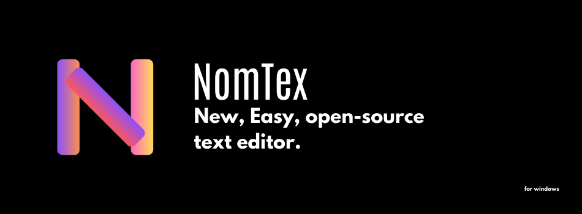

# NomTex
 NomTex is a easy and open-source, gui text editor. It is developed with Windows Forms and Visual Studio.
 
### How I Can Download NomTex?

 - 1. With Setup File
     Download the NomTex Setup File from Releases
     and install this. You downloaded NomTex.
 - 2. With Zip Files
     Download the .zip file from Releases and extract it.
     Run the NomTex.exe. You downloaded NomTex

### Where Is The Source Codes? 
  Source Codes is at the this repo. You can download it.

### What language options are there?
  Currently there are only Turkish and English options. (If you would like to use the ENGLISH version, please download the installation file/.zip file named 'NomTex English'.)

# NomTex 1.5

NomTex 1.5 is available for download!

### What is the news?

1. "Edit" Menu

 There is now an "edit" menu. You can find, copy, paste and cut from this menu.

2. "Find" Function

 The "Find" function has been moved to the edit menu. And it has been renewed. (It can still be run with the CTRL+F shortcut.)

3. Right Click Function

 Now when you right click, you will be greeted by a menu with copy, paste and cut operations.

4. Changing Font Style

 You can now change the font style of your text to normal, bold, italic, underline and strikethrough.

5. Bug Fixes
 The bug where the text's changed properties reset each other has been solved.

